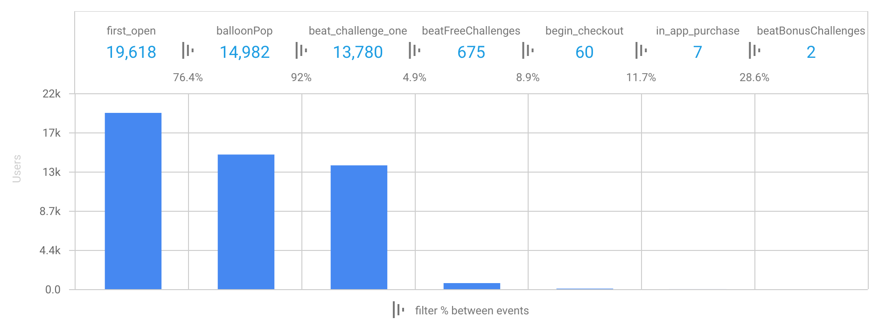

After Apple's announcement of ARKit and leaving my job at [Sidekicks](sidekicks) in June of 2017, I began a six month sabbatical researching and learning design and development for augmented reality. During that time I was inspired to create [Out Here Studio](http://outhere.studio), my own creative software business. I published my first title in December 2017, [Out Here Archery](https://itunes.apple.com/us/app/out-here-archery/id1309822636?mt=8), a playful first person shooter in mobile augmented reality.

https://www.youtube.com/watch?v=kPtwy8a9Gg8

# Gameplay design

I bucked the trend of small-scale, table-top experiences that most other AR creators were pursuing at the time to make something that was immersive, larger-scale, and best enjoyed outside. I paid particular attention to how the game interacts with the player's environment, pushing for an experience where the scene mixes with the virtual objects in fun and clever ways.

My attention to mixed reality design details can be seen in the behavior of balloons and arrows in the game. Balloons inflate from any surface within the scene (unless they're above the camera, i.e. the ceiling). Arrows stick into surfaces with a satisfying _plunk_, allowing you to walk over, pick them up, and use them again; or they hit and scatter away, depending on their angle of attack. The bow, balloons, and arrows all cast shadows on each other and the surfaces beneath them.

# Sound design

I collaborated with Maxime Gautier and Noah Sitrin on the game's sound design. I chose to work with professional sound designers and create all custom sound effects rather than rely on pre-existing audio clips to have full control over the game's soundscape. We paid particular attention to the spatial nature of each interaction, carefully tuning the 3D attenuation of each sound effect so they would be subtle and delightful, but not distracting. The game intentionally does not have a background soundtrack in order to not detract from the immersive illusion, relying on the dynamic sounds of gameplay and your environment.

# Modeling

I did all of the 3D modeling for the game in virtual reality, using my HTC Vive and [Google Blocks](https://vr.google.com/blocks/). I had essentially no CAD experience prior to making Out Here Archery. The intuitiveness and fun of modeling in VR with Blocks was a huge motivation when getting started.

I had to process models a little bit after exporting them from Blocks to precisely adjust their scale, rotation, and UV mapping. I learned and used [Blender](https://www.blender.org/) to accomplish that. The difficulty and unintuitiveness of modeling in Blender made me all the more excited for the future of 3D creation tools.

I [published all of the 3D models](https://poly.google.com/user/6ygncoac9fM) I created for the game on Google Poly under Creative Commons Attribution licenses. You are free to download and remix them into your creations as you like!

# Development

Developing the game was much slower than I would have liked. The newness of the tools and technology meant that bugs were common and thorough documentation and best practices were not. The most painful part of the process was the time between iterations. Building the project from Unity to Xcode onto a device took between four and seven minutes with my laptop. Every time I wanted to tweak something, or forgot to save a file, or forgot to uncomment a line of code, meant five minutes of waiting with a CPU pegged at 100%. In the final month of the project where I was focused solely on finer details and edge cases, 15-20% of my time working on the game was spent waiting for it to build. Coming from a web development background where iteration speed is practically instant, this was agonizing.

Unity did make a tool called the ["Unity ARKit Remote"](https://blogs.unity3d.com/2017/08/03/introducing-the-unity-arkit-remote/) for streaming the data from an AR session on a device into the Unity editor on a separate machine. Unfortunately it was not usable for me. It did not support touch interactions and had too low of a frame rate. Displaying the virtual game objects in the editor also meant that I couldn't see how the experience really looked and felt on the device.

The core interactions were complete by late September, as you can see from the two prototype gameplay videos below. The remaining three months were spent designing the game mechanics, modeling the rest of the balloon types, developing their special effects, creating and implementing sound effects, and refining the physics and intro sequence.

https://www.youtube.com/watch?v=NMPbNBC0L4E

https://www.youtube.com/watch?v=q9oYHUkPWzc

# Testing

I beta tested the game for about five weeks, recruiting family, friends, and strangers to try it out and let me know what they think. I encouraged testers to record themselves playing so I could see what they were experiencing (the new screen recording ability built into iOS 11 was very helpful). The kids who were testers would prove to be the most critical and helpful.

<figure style="max-width: 400px;">
<video src="playtest.mp4" controls width="100%"></video>
<figcaption>
This was the first play video I got after putting out the beta. I could not stop smiling the first time I saw it, I watched it at least three times in a row 😄 Kids are the absolute best.
</figcaption>
</figure>

The most important change that came from beta testing was redesigning the game for limited mobility situations. After talking with a wheelchair-bound student who helped me test the game, and seeing a [truly amazing product called "Animo" at the MIT product design final presentations that reduces tremors for people with Parkinson's disease](http://web.mit.edu/2.009/www/interestMedia/final/final2017/purple.html), I was moved to change the game to enable people to enjoy the experience from a sedentary position. I was challenged to rethink my vision of people _having_ to move to play the game, and in the end made a better game for having done so. It was another lesson for me in how constraints are a good thing in product design.

# Release and reception

As of this writing the game has been out a little over a month. During that time I've had about 20,000 people download Out Here Archery from over 50 countries, shooting over 1 million arrows and popping over half a million balloons. The game has been most popular in the United Kingdom, Russia, and Thailand (the United States isn't even in the top 10!). I'm glad I internationalized the pricing and distance units! I have not pursued any paid marketing, yet.

Looking at the engagement data, many people appear to be confused or overwhelmed. As I observe more and more people play the game, it's clear that many people are not intuitively understanding the spatial relationship between where they're looking and the virtual objects on screen. Most commonly, people swipe towards balloons to try and aim instead of looking at them with the camera. Most people do not look or walk around very much. People are choosing limited mobility mode 96% of the time. I am very curious whether this misunderstanding is specific to my game, if it's the social stigma of walking around with your phone in front of your face, or if it's simply from the newness of augmented reality on mobile devices.

## Monetization

I chose to make the game free to download with an in-app purchase for $2.99. The purchase is revealed after beating the first three challenges and unlocks the remaining four. This strategy has not worked well. I plan on redesigning the game mechanics and monetization strategy. I would like to incorporate advertising within the game, but in augmented reality instead of a simple banner ad or promo video. I haven't discovered any ad networks or Unity integrations that would enable this easily. If you know of any, please get in touch.

