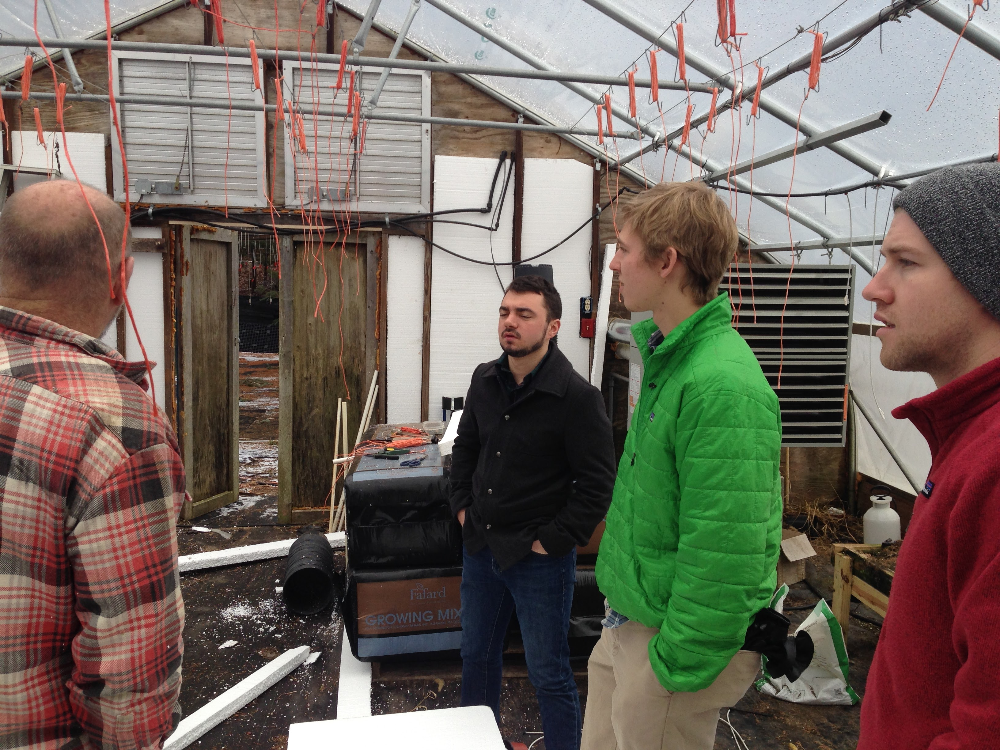
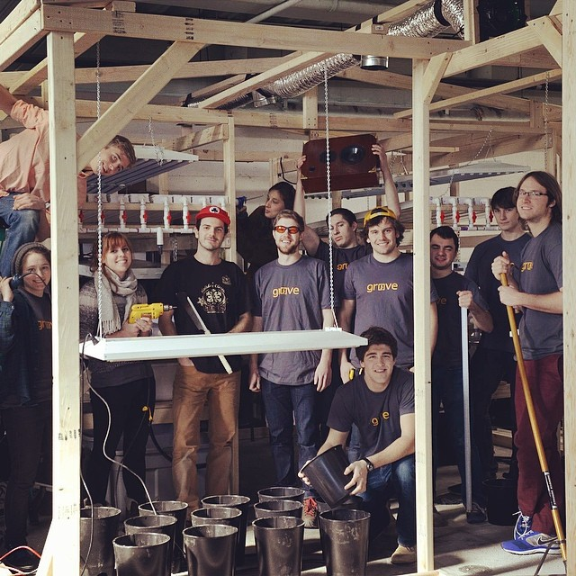
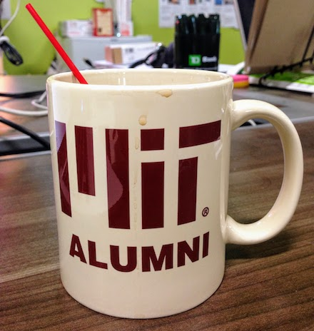
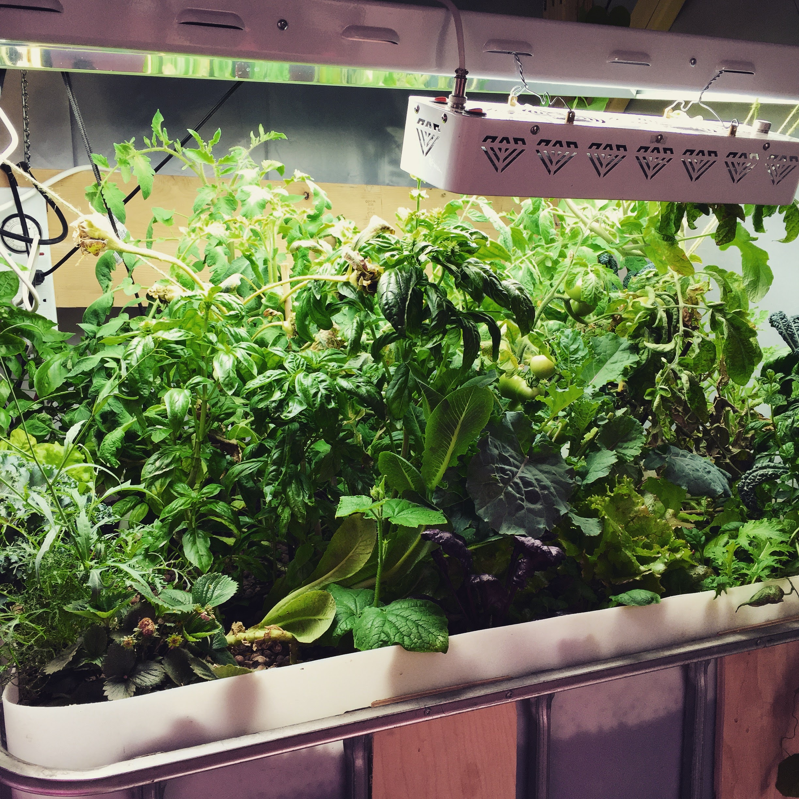
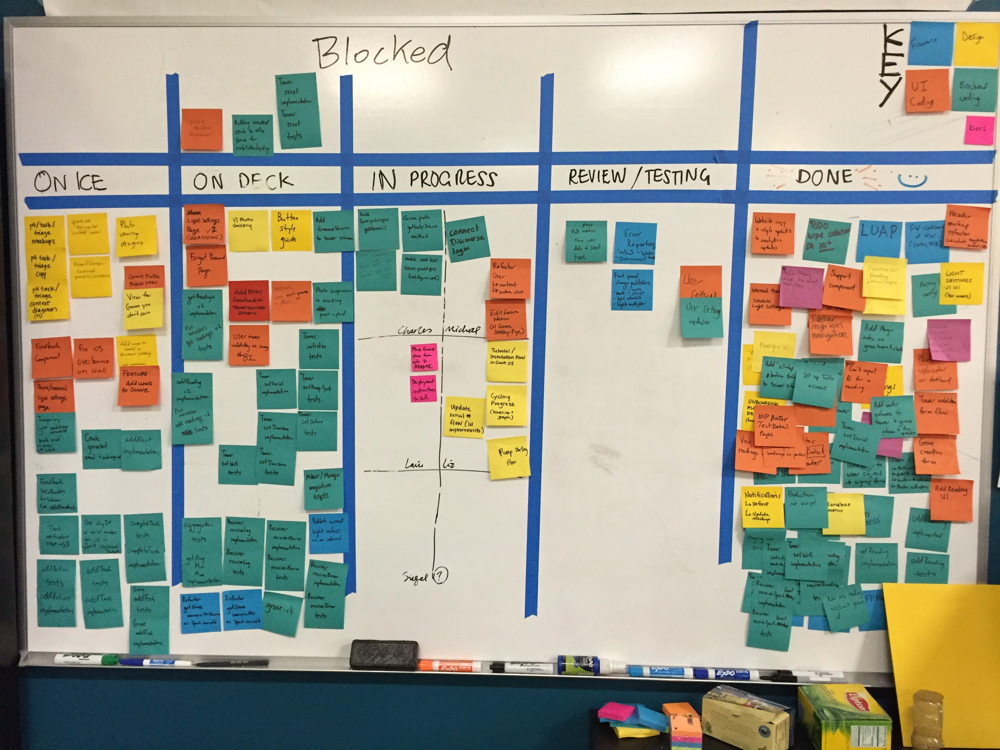
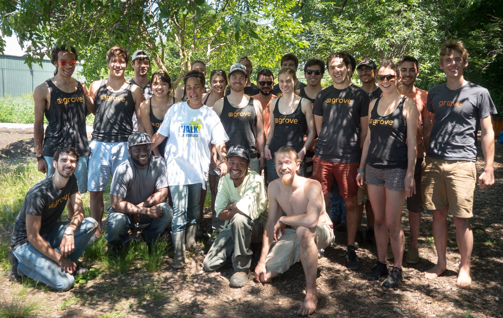
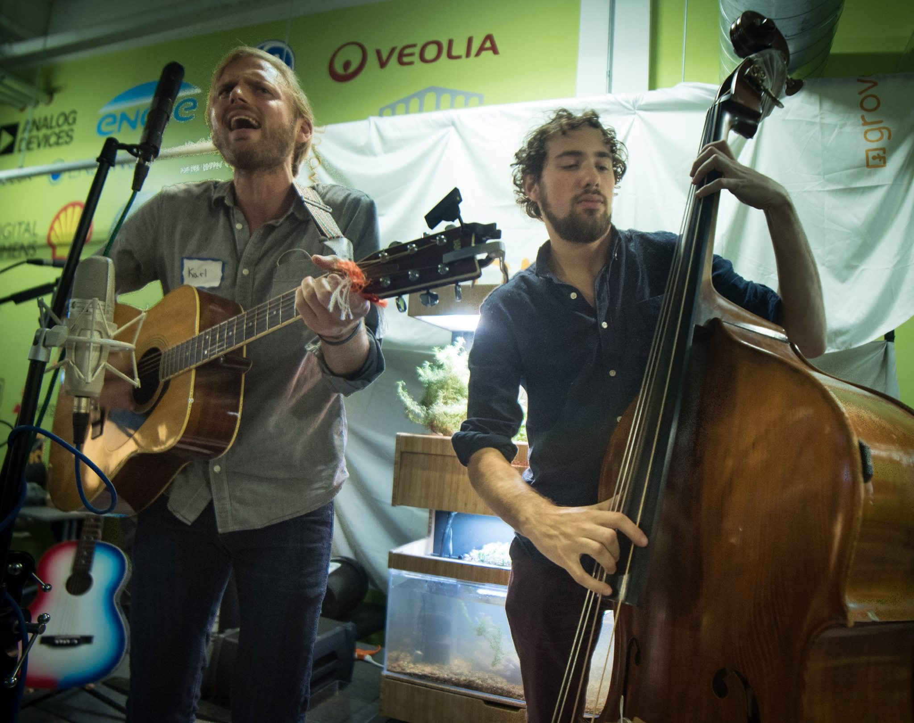
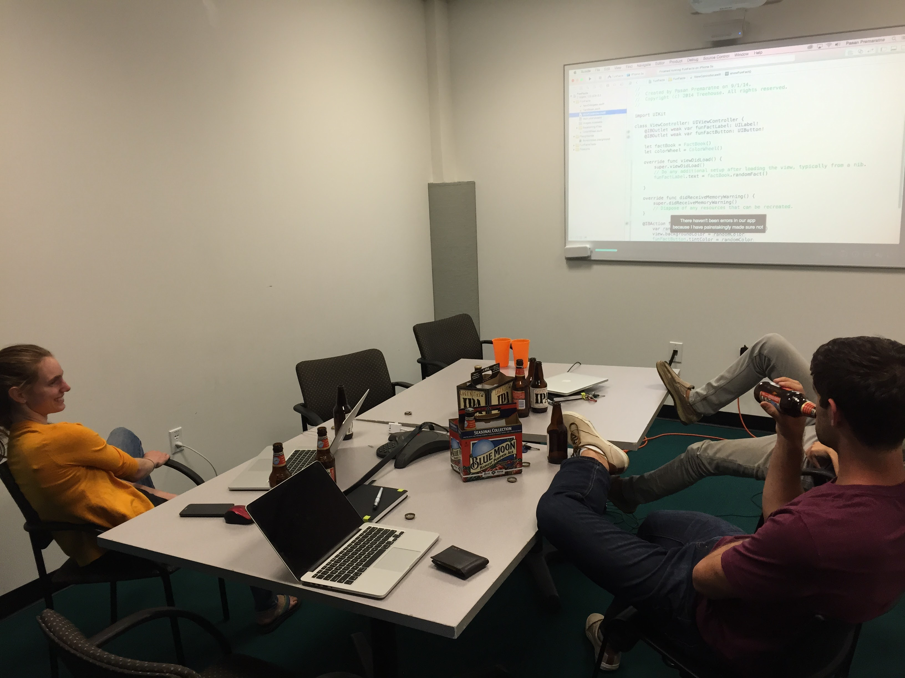
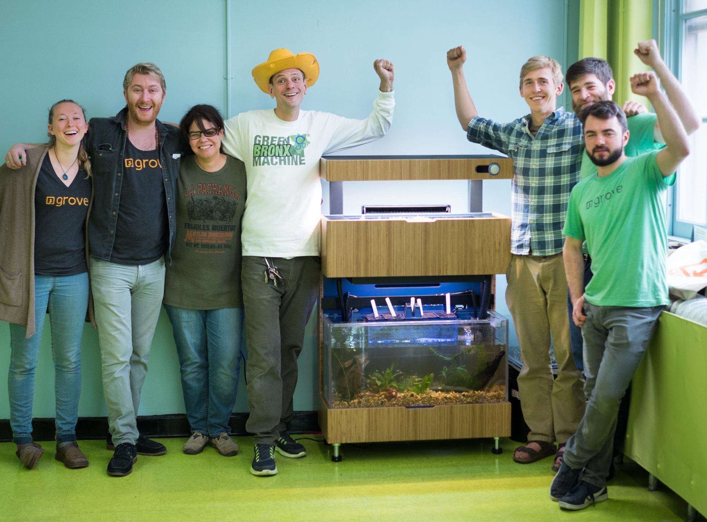
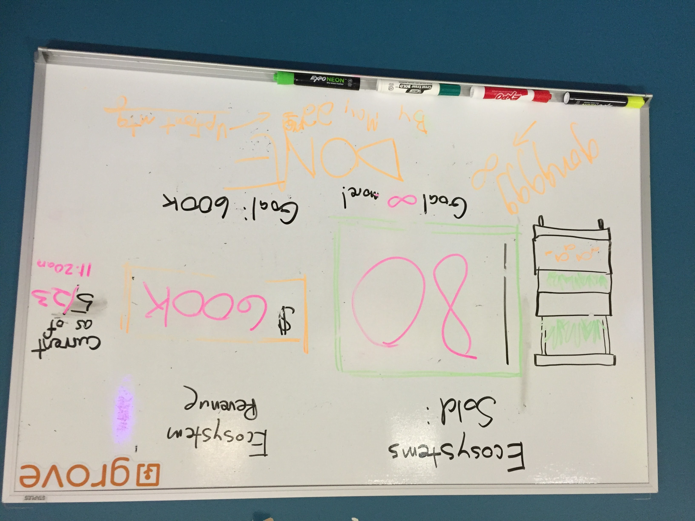

[Grove](https://grovegrown.com) was my life from the very beginning of 2014 until the end of June 2016. Over the course of that time I was a key member of a small, tight-knit team that designed, manufactured, and shipped two generations of beautiful, "smart", indoor aquaponic gardens. We sold and supported large hardware systems that cost between $1,000 and $4,5000 to over 200 customers, teaching and guiding each of them how to steward a living, productive ecosystem in their home.

I architected the software behind the two products — a distributed system comprised of connected embedded systems, web and native apps, and a real-time back-end. I was the lead software engineer and co-product manager with our UX designer, Liz Cormack. More details about the choices and challenges of making those systems are in [Making the software, round 1](#making-the-software-round-1) and [Making the software, round 2](#making-the-software-round-2).

In addition to the software for our products, I built internal dashboards, created marketing and commerce websites, setup and moderated our online community, and managed the company's generic IT services. I helped craft and execute technical marketing strategies, including a successful [Kickstarter campaign](#kickstarter). I played a pivotal role in recruiting, team culture, and corporate governance. I was also the [head of sales and strategy](#sales) for my last few months at the company.

<figure>
<a href="grove.gif">

</a>
<figcaption>
A beautiful Grove Ecosystem
</figcaption>
</figure>

# The beginning

I joined Grove during the January of my senior year of college. They had just moved into a space at the new [Greentown Labs](https://www.greentownlabs.com/) location in Somerville, MA, and were in the midst of the [RGA Connected Devices accelerator](http://rgaaccelerator.com/connecteddevices/) in New York City. I joined the company after hearing my good friend and fraternity brother Chad Bean rave about it for a few months. He was their electrical engineer and one of only four or five people who worked for the company. Grove had been created during the prior year and gone through MIT's Global Founder Skills Accelerator (now [_delta v_](http://entrepreneurship.mit.edu/accelerator/)) program that summer. Chad had been working with them for the fall semester and mentioned that they were hiring folks for IAP, MIT's January term. I had been inspired to work for a consumer hardware startup after attending a talk by Eric Migicovsky, the founder of Pebble, that fall, and was focused on finding one to work at after graduation.

Several other new people worked for Grove that January, effectively tripling the number of people who had ever worked for the company at one time. Those four weeks were a jam-packed sprint. We worked on everything from building an indoor research farm inside of a warehouse, to interviewing indoor farmers all around New England, to writing Python for sensors hooked up to Raspberry Pi computers, to designing an automatic fish feeder, to creating the beginnings of an API for internet-connected sensors, and more. Gabe Blanchet & Dave Bowker, our CEO & our head of operations, were in full swing with the RGA accelerator, living in an apartment in New York half of the time.

The first role I had at Grove was "Lead Community Engineer." I was told that the other software engineer on the team, Kenny Siebert, was handling the whole back-end and I was responsible for crafting a vision of how we would bring together people from all of the communities that may be interested in Grove.


Creating community is fundamentally about understanding culture, so for much of that first month I set about learning the culture of farming, food, and agriculture. We already had a small company library, so I read my way through a few of the titles such as _The Omnivore's Dilemma_, _Teaming with Microbes_, _The Essential Urban Farmer_, and _The Vertical Farm_, and watched some documentaries on the food industry, such as _Food, Inc._, _Forks Over Knives_, and _King Corn_. Up until this point in my life I was blissfully unaware about how my food arrived at my table and the costs that our food systems were having on the Earth. That abruptly changed.



That month was a hodgepodge of development. We felt like were doing so much! But only a fraction of what we did that month contributed much to the future of the company. We were a group of young and eager engineers and designers, given a bit of direction and a whole lot of empowerment and inspiration to go do **something** to help this small company progress. The nice thing about working with highly competent and motivated people is that simple direction like that can be surprisingly productive. Or at least give a good appearance of it.



# Farmers or gardeners?

The [original pitch](https://vimeo.com/100816582) that Gabe and Jamie made for Grove when they founded the company was for a personal indoor farming appliance. Gabe begins his presentation with an incredibly bold claim — _In five years you're going to be able to grow half of your own food inside of your house_. He goes on to show a physical prototype of a product called the "Cortex" and discusses a brief plan for developing sensor and data technology for indoor farms, but he ends his pitch where it began. He shows a glimpse of the real dream — a "modular home farming appliance the size of a bookshelf"; an appliance that will be "as ubiquitous in people's homes as refrigerators or microwaves."


While the company would try developing sensor technology for indoor farms for the next year, it was always the consumer appliance idea that garnered the most interest from investors, employees, and the general public. We would end up scrapping all of the work that we'd done on the greehouse technology product, "pivoting" that May when we got our first round of funding.


# Funded

When I graduated that June, Gabe had just secured the company's seed round for a little over two million dollars, and I had just been promoted. Kenny had decided that he was not interested in staying on after graduation, instead choosing to focus on his Masters degree. Gabe offered me the position of Software Lead and a whopping 5% stake in the company. I was way too idealistic to be skeptical of the terms on the options. I would get paid enough to make rent and starting paying off my student loans, and maybe my hard work and execution on this crazy dream would make me a millionaire. Or maybe I would just get to learn a lot of what I wanted to, working on something meaningful with my own team. I was beyond thrilled.



Flush with cash, full of enthusiasm, and fresh from sipping from the MIT firehose, we embarked on growing the company and producing the first batch of prototypes of a home gardening appliance. I set about figuring out how to recruit people for software. And I began my deep-dive on all of the parts of the puzzle of making a system of smart indoor gardens.

We had a lot of fun and a little bit of failure that summer. We started out the summer with five full-time employees and four or five interns. We grew to ten full-time employees by the summer's end. Emily Malkin, Liz Cormack, Brooks Eaton, and Nate Williams joined the company, all of whom became essential teammates and close friends. We had an engineer, Andrew, quit in frustration after Gabe and I bungled a conflict that started from a disagreement over which software framework the company should use.

I stumbled my way through my first time being on the other side of an interview and began to understand how difficult it is evaluate someone's competency and trustworthiness from just a couple brief meetings. I hired my friend and classmate, Michael Sanders.

We went on our first company retreat, fleshed out the research farm, started our tradition of having [#grovegrown](http://instagram.com/explore/tags/grovegrown) lunch every week, and made fun videos about the importance of culture.

https://www.youtube.com/watch?v=0os7_w4i1Og

For almost everyone in the company, Grove was our first paid full-time job in these roles. We were basically the same age as our interns. Emily had just graduated. Liz was on her own as a designer for the first time. Nate would leave college early to come work at Grove full-time (and would turn out to possibly be one of the best home aquaponics designers in North America).

Most visibly, we produced our first batch of prototype appliances — simple, un-connected, plumbing-free hydroponic gardens.


# The Early Adopter Program

As we moved into the fall we began work on a new appliance design. This one was to look very similar to the early sketches. It would have custom electronics and lighting, be connected to the internet, use aquaponics instead of hydroponics, and be made of wood. The plan was to sell this version to a limited number of people in the local area so we could manufacture and distribute the product ourselves. This would enable us to practice the principles of a "lean startup" and lean manufacturing — building iteratively, finding points of failure quickly, and solving issues quickly and early.

We hired more people. Tim Day joined the company, an Australian ecologist who had actually practiced aquaponics professionally. I hired Abigail, a software engineer that found us through the Meteor community. She was the first person I hired whom I didn't already know. And we hired Carol, our first full-time marketer.

We went about finding customers through hosting open houses at our office, putting prototypes in a couple local businesses, and speaking at various food and tech events. We also began to get some press attention, getting a segment in [the local news](http://www.wcvb.com/article/team-bringing-fresh-food-gardens-to-high-rises-near-you/8049206) and an article on [The Verge](https://www.theverge.com/2014/11/18/7242771/grove-labs-wants-to-put-a-tiny-farm-in-your-kitchen). Gabe and Jamie also received some flashy accolades that fall when they were selected as [Forbes 30 under 30](https://www.forbes.com/pictures/ehde45ekmdk/gabe-blanchet-23-jamie-byron-23/#79a3f47830bb) and [Kairos 50](https://www.gettyimages.com/event/kairos-global-summit-2014-518954671#grove-labs-cofounders-jamie-byron-and-gabe-blanchet-attend-the-2014-picture-id457450768), both annual lists of promising young people. The fact that we hadn't shipped anything yet apparently didn't matter; the seeming magic and good looks of the prototypes, combined with their rhetoric and the "made by MIT engineers" pedigree, was enough. We hit our goal and sold about 100 units to fifty people that fall and winter, for around $1,000 each.


# The insane Boston winter of 2015

That winter we threw ourselves into our work. And the winter threw itself onto us. That year was Boston's [snowiest winter on record](https://weather.com/news/news/new-england-boston-record-snow-tracker). Snow came down in feet, not inches. We witnessed two of the top ten snowiest storms in Boston less than two weeks apart. Walkways were cut through snow mounds that were five, six, seven feet tall. Going outside resembled more of an arctic zombie apocalypse than walking through a bustling busy city.


Work was like an oasis. The GURF — the **G**rove **U**rban **R**esearch **F**arm — was filled with life and light. My breaks consisted of walks back to the farm to help out, and to harvest. One of my favorite activities was making lunch with fresh food harvested from the GURF, usually with someone else on the team. The act of deciding and executing on how to prepare something as simple as lunch can help strengthen trust and relationships. Sharing in the of growing, preparation, and eating good food was one of my favorite parts of Grove's culture.



Those winter months saw more solid growth. Nick came on full-time after graduating. We hired Mike Zartarian, a veteran electrical engineer, whom Chad and I met after I gave a one minute pitch I gave at the end of a Boston Hardware Startup Meetup event. Mike brought along Mike Siegel and Karl Henricksen, an excellent embedded systems engineer and test engineer, respectively. The three of them had far more experience in shipping a consumer electronics product to paying customers than anyone within the company. They brought a new level of quality and stability to the team.


I had my first intern that January — Steph Northway, a cool cat from Olin College. Steph and I met each other over a twenty minute Skype interview during the winter holiday, at the end of which I extended an offer and she accepted. I also hired Charles Renwick, a recent college and coding school graduate from Seattle. Charles would go on to become a close friend, and roommate several months later. He also turned me on to [React](https://reactjs.org/), a JavaScript library for building user interfaces that was about to have its breakout year.

<figure>
<a href="softwaregroovin.gif">

</a>
<figcaption>
Charles, me, and Steph, seen here on a typical night at the office.
</figcaption>
</figure>

# Making the software, round 1

## Sparticle

When Mike Siegel joined Grove, I passed on the responsibility for writing new parts (and fixing the old parts) of the firmware to him. Chad and I had decided to build on a microcontroller called [~~Spark Core~~](https://www.kickstarter.com/projects/sparkdevices/spark-core-wi-fi-for-everything-arduino-compatible) [Photon](https://www.particle.io/products/hardware/photon-wifi-dev-kit) made by startup named ~~Spark IO~~ [Particle](https://www.particle.io/). The platform and company were new and unproven, but it allowed us to use our existing code written for Arduinos and avoid having to implement low-level integration with a wifi chip and network protocols. Sprinkle in some `Spark.publish` and `Spark.function` calls and we had ourselves a network-connected device with a good abstraction.

Building on the Particle platform had its trade off. They claimed that tens of thousands of products were shipping with Spark Core inside, but our day-to-day reality did not jibe with that. The recommended method for a customer to setup their device on wifi only worked about 50% of the time. The recommended recourse at that time was to _pre-program customers' wifi info into each unit_. So we did. We collected network names and passwords from everyone beforehand and loaded them into each tower on the manufacturing line. Inevitably we had typos (did **you** know Google Sheets strips leading zeros in a cell? 🙄). In more than a few instances we had to drive out to people's home, plug in our laptop to their grove, and change the credentials manually.

Before we fully finished the firmware, we **ran out of room on the Spark Core**. The microcontroller had 128 KB of storage, of which only 70 or 80 were available for application code. We were down to less than three kilobytes of space. We had to hold off on implementing some features because they needed too much new code to implement. It was almost comical. _Almost_.

About a third of the way through our manufacturing, Particle started shipping their newer microcontroller, Photon. It had 1 MB of storage, was cheaper, and had a wifi setup that actually worked. We did the work to port our system and thoroughly test it as quickly as we could in the middle of production. We went out and replaced all of the Spark Cores already in customers' homes.

Building with new, open source platforms from startup companies was difficult. While they offered advanced features and visibility into the code, they did not necessarily offer transparency or stability into their priorities or thought processes. Sometimes it was a struggle getting the Particle engineers just to believe us when we found bugs. One time Karl and Siegel had to send a complete circuit and router setup to them in California to demonstrate a particularly tricky flaw.


## Meteor and Mongo

In the beginning of the product cycle I had been told that we needed an app that could run on iOS and Android. Since my strength was in web development, I had recommended to make a mobile web app, versus two native apps. That was how we began building with a full-stack framework called [Meteor](https://www.meteor.com/). We had decided to use it because it got us a lot for relatively little. It had incredibly easy setup, made making a dynamic web app easy, and had clear paths for making a real-time back-end. A lot of this magic was accomplished by coupling the architecture to a database called [MongoDB](https://www.mongodb.com/).

Meteor was a young framework and company. It hadn't even reached a self-proclaimed version one, yet. It had a half-baked story around testing and scaling. It had a magic, messy abstraction between client and server code. It used a lot of global variables. But we were facing relatively small scale, it's what I already knew, and I didn't fully grok the consequences of choosing a SQL or "NoSQL" (documents instead of rows) database. I placated my uncertainty in Meteor's new style of architecture by getting involved in the open source project and the Boston Meteor Meetup, even hosting the event at our office a few times.

<figure>
<a href="meteor.gif">

</a>
<figcaption>
😬 😅
</figcaption>
</figure>

## React

When Charles shared [Pete Hunt's original talk introducing React](https://www.youtube.com/watch?v=x7cQ3mrcKaY) with me, it resonated strongly. The web application front-end was approaching somewhere between 15,000 and 20,000 lines of code, the largest application I had built so far. The boundaries between parts of the UI were already becoming difficult to reason about. The predominant principle of building UI on the web up until this point was "separation of concerns" — dividing an application's components between structure, style, and logic. To think about the application as sections of a document. Doing it this way had led to brittle, "magic" references in between files. Everything was still coupled, just across different file types and without guarantees.

React guided you to divide your application across logical boundaries and define clear interfaces between your components. The approach excited me so much that I moved to port our front-end to React within the first month of watching Pete's talk. I wrote and released [one of React's first integrations with Meteor's live data architecture](https://github.com/grovelabs/meteor-react) and guided the team to begin making a reusable component kit.

Later that year I would be invited to give a talk at the monthly Meteor devshop in San Francisco where I went into much more detail on all of this. (I was so nervous during that talk, my first in industry, that I looked at a picture of strawberries and obliviously call them tomatoes. Twice.)

https://www.youtube.com/watch?v=cctY_K5-Xyg

Overall I was amazed at the complexity and confusion involved in simply choosing the tools and services for shipping software. The sheer number of pieces to the puzzle and ways to arrange them is staggering. There were barely any clear answers or best practices for anything we set out to build because everything kept _changing_ so much. It took me a while to understand the historical context driving my anxiety over understanding how it all fit together.

The art and industry of making software has been changing since the creation of computers, but especially so since 2008. Cloud computing. Mobile apps. Continuous integration. Containers. JavaScript's big leap forward. The Internet of Things. The rise of open source everything. Nearly every sub-discipline of software engineering is undergoing significant change and improvement. Understanding and embracing that change promises a simpler way to make more reliable, usable software. What that meant for me was hours upon hours of reading blogs, watching talks, and reading documentation for tool after tool after tool. The concept of "industry standard" choices wasn't quite a reality yet, but it seemed like it would be soon — I just had to figure them out.

## Conflict in the software team

In late January, Gabe and I again failed to resolve a conflict within the software team. What started as a small disagreement over how to model some data grew into a full blown rift between Abigail and the rest of the team. My poor planning and our underdefined specifications had led us to removing a good chunk of her work when the design changed direction. She was frustrated with spinning her wheels and felt like she wasn't being respected. I was overfocused on my code contributions instead of articulating the plan and running the team. The data modeling disagreement was simply the final straw. Gabe tried to solve the problem by avoiding it, deciding that Abby would work on different code done almost completely remotely (she had been driving up from New York). This only exacerbated the coordination problem. We parted ways shortly thereafter.

# Shipping my first product

The huge piles of snow eventually did melt. I took home a prototype and put it right next to my bed. Deadlines slipped. Problems arose. Our customers understood. We fixed the problems. Nick [wrangled the manufacturing](https://www.youtube.com/watch?v=BcmY7X5rStI). Spring came and went.



We delivered our first units at the end of May. I finally shaved the beard I had been growing since November. We continued delivering throughout the summer. Everyone took part in deliveries. Jamie and Tim [went on a cross-country roadtrip](https://www.instagram.com/p/7xrcb_w1B1/) installing Groves at a handful of places around the country and spreading the word along the way ([#GroveTripUSA](https://www.instagram.com/explore/tags/grovetripusa/)).


We had more interns. We went on more retreats. Chad decided to leave for another startup. Steph joined full-time. Matthew Seaton and Arjun Varma came on as full-time ecologists. We hired someone just to do social media. We had no head of marketing or sales, aside from Gabe. We had very little company structure at all. We relied on self-organization and self-accountability. Gabe and Jamie tossed around terms like "holocracy" and bubbles when describing their vision for how the company should be organized. They were practically allergic to traditional ways of structuring a company.



## Customer love

One of the most unique parts of Grove was how often we would hear from people who absolutely loved what we were doing and supported us whole heartedly. Building a movement and a product that centered around Nature connection meant frequently coming into contact with extremely kind, concerned, and compassionate people. We would get messages almost daily asking when we were going to be shipping to some part of the world, wondering what they could do to get their hands on one **now**.

That was no more true than with our early adopters. Many of them were posting frequently on our forums, eagerly sharing their fun and failures. It was one of the most satisfying feelings in the world to watch. The [first baby was born into a home with a Grove](https://www.youtube.com/watch?v=jWZe2xrqWEA). One woman told us about how she would talk to her plants every day, telling them what a good job they were doing. One father and son [started a small YouTube series](https://www.youtube.com/playlist?list=PLDn5j59RTWJlpq_yPIePZy4NxDv19pqo2) cataloging their experiences. Customers adored their Groves.

https://www.youtube.com/watch?v=jRAK3tnJK5I

# Running out of money, pt. 1

Around the end of summer we found ourselves just about out of money. While we had put out a product and were seeing happy customers, when it was all said and done we were losing around **$2,000** on each tower sold (a single system could have one, two, or three towers). We were not seeing much revenue at all from selling supplies. It became clear that it was not a plausible idea to sell this version of the product on even a regional scale. We needed to redesign. We needed more time. We needed more money.

Our lead investor gave us more money — somwhere between $500k and $1M — but this time they tranched it. We would receive half now, and the other half after obtaining $600,000 in revenue. Our given runway was less than a year long. We had to redesign, we had to have a crowdfunding campaign, and we had to do it _now_.

The [first thirty second of this video](https://www.facebook.com/GroveLabs/videos/1197171806964932/) gives a sense of the reality distortion we were collectively experiencing at that point. We were still riding the wave from our first product and thought we could do no wrong. Sure, it was having some problems, but people loved it. And Nate was already working on exciting prototypes of a great new design.

We decided to go for it. We were exhausted, we were stretched thin, and we were going to do it all again. But this time, _**even bigger**_.

# Kickstarter

The [Kickstarter for the Grove Ecosystem](https://www.kickstarter.com/projects/grove-ecosystem/grove-ecosystem-grow-fresh-food-in-your-home) took place from November 2nd to December 10th of 2015. We went all out. We hired a PR firm and hired more full-time marketing people, Matt Lowe and Marcos Rocha. We got in direct contact with the team at Kickstarter and installed an Early Adopter Ecosystem at their office in Brooklyn. We had a special reveal party for our early adopter customers where [Arjun laid down a sick beat about aquaponics](https://photos.app.goo.gl/zlzYfsYgFB0b0R3n2).

The hardware team worked magic, producing looks-like, works-like prototypes in less than three months. We made sexy software demos that walked people through the system and showed off the new full-spectrum lighting design.

I vividly remember standing over Matt's shoulder as we launched the project, squealing with excitement. I was backer #1, buying the first Ecosystem for my parents in Houston.

https://www.youtube.com/watch?v=P6qQjADFYhE

We had a killer launch party at our office in Greentown Labs where we celebrated and danced the night away with a couple hundred of our fans, friends, and family. I even brought my cello and got up on stage with Karl, Siegel, Jamie, Nate, and Mike as the Grove band to play some rock and bluegrass as the night wore on.



Over the course of the campaign we hosted four more parties across the country in San Francisco, Boulder, Seattle, and Brooklyn. (I wouldn't attend any of them, staying behind to work.) We [garnered](https://www.engadget.com/2015/11/03/grove-ecosystem-aquaponics-kickstarter/) [more](http://www.businessinsider.com/grove-lets-you-grow-food-at-home-2015-11) [press](https://www.fastcompany.com/3052682/this-intelligent-indoor-garden-for-your-house-grows-greens-all-year-round). By the time it was all said and done we had over 500 backers and $400,000 in pre-orders.


# Making the software, round 2

As part of making the Ecosystem we decided to scrap ongoing development of the Early Adopter Ecosystem. For the hardware team, that meant not manufacturing any more units. For the software team, that meant not developing any more features or fixing any more bugs. This was particularly painful for me. Key features were still half-complete. The app was objectively frustrating to use in some spots (the sliders for changing the lights 😰). We had barely gotten the app into people's hands before being pressured to forget about it and make a new one. The majority of what we had written so far was now technical debt.

## Web app: out. iOS app: in.

Making a mobile web app did not turn out like we had hoped. Touch interaction were janky; animations jittered. Overall, it just felt cheap. Making a web app that feels as good as a native app is still not possible, to this day. We decided we wanted more polish. We also decided we were alright with only doing iOS, that we would literally send a free iPod touch to any customer who didn't have an iOS device already (if only we had reached that conclusion the _first_ time... 🙄)



## Meteor: out. REST API: in.

Within two weeks of giving my talk in San Francisco we stopped using Meteor. The back-end was extremely coupled with the front-end, and we were getting rid of the front-end. When I ran into a senior Meteor engineer at a conference earlier that summer, he had literally laughed when I asked when the poor testing situation was going to be straightened out. Their roadmap had more churn in store, not less. We decided to use a paid service for real-time data instead of building our entire architecture around it. We built a REST API using a small server library called [Koa](http://koajs.com/).

## Mongo: out. SQL: in.

[Going to MongoDB World](https://twitter.com/louisdescioli/status/605460869355589632) earlier that summer had been an eye-opening experience. Aside from being my first tech conference, everyone there kept asking each other in puzzled tones, "why are _you_ using Mongo?" Only after hearing that for the tenth time did I realize the other implicit question being asked was, "why _aren't_ you using SQL?" After moving off of Meteor, I didn't have a good answer for that. We used Postgres the second time.

## Michael leaving

Michael decided some time that fall that he'd had enough. I was completely caught off guard the day he told me. There was nothing I could do to convince him to stay. I was very sad when he left. He was my friend, my first hire, and had been my right hand man through many memorable and difficult times. He'd kept me humble in simple ways, like the sign on his desk ever posing the question, ["Who's the more foolish, the fool, or the fool who follows him?"](https://www.youtube.com/watch?v=x0ow4X8tiMI)

Even before Michael left, I had decided to take a different approach to the software team's strategy this time around. Instead of everyone being generalists, we would specialize. Siegel owned the embedded system, Charles and Steph owned the front-end, and Michael and I owned the back. With him leaving, the back-end and operations were now solely my responsibility.

## Leadership struggles

We spent a good amount of time that fall trying to recruit a senior software engineer and meeting with potential agencies. I was very open about wanting more mentorship and experience on the team. Having no senior leadership was the worst part of Grove for me. Mike Zartarian, who was effectively our CTO, had very little faith that me, Charles, and Steph could build a new and improved app and back-end in time. At one point he tried to get Gabe to replace me. Gabe's direction on the issue swung drastically from week to week. One week Mike was head of the software team and I needed to run everything I did by him. The next week Gabe was the head of the software team, and Mike was not to have any participation. At one point I openly challenged Gabe to either trust me or fire me after he questioned my basic competence in a meeting with Liz and Siegel. He decided to trust me.

In the end, the ordeal was helpful for me. It forced me to hyper critically examine our architecture and technology, and I made a couple better decisions for doing so. But the scheming, passive aggression, and weak leadership would be a lasting sore spot and a memorable lesson of what _not_ to do.

# The E-team

Over the holiday break, I spent a lot of time discussing Grove's leadership struggles with with my family. We were having more and more issues around communication and cross-team decision making. My uncle pointed out the fact that the company did not have an executive team, or even really a board (the board had only one member aside from Gabe and Jamie and he was a junior VC partner that had never run a company). He gave me a book, _The Five Dysfunctions of a Team_, that he used as a framework for understanding leadership issues in his management consulting. It's a practical guide for figuring out what's fundamentally broken within a team and how to fix it. It has has proven to be very helpful for me, both then, and in the future. When I came back from my vacation I gave Gabe the book and [this talk from the author](https://www.youtube.com/watch?v=inftqUOLFaM) and pushed for more structure within the company. I said it was time to mature and move beyond the egalitarian, self-organizing approach we had used so far. From those discussions came the executive team, quickly shortened to just the "E-team".

# Getting into the App Store

The goal for the software team was to have

https://photos.app.goo.gl/AHY50WCPmKtJ1Wul1 submitting the app, round 4

# The dirty laundry

# Sales

## Stephen Ritz

https://www.youtube.com/watch?v=RF6qTlgtHU0





# Running out of money, pt 2

# The end

HBO's show _Silicon Valley_ was in its second season, and we used to get together each week to watch it each week. We would laugh along at the parody of our lives.

## Resignation letter

```
Eight hundred and eighty nine days since I first stepped into this office
And after two products, two apps, & five million dollars, the time has come for me to cut my losses

I took some time last night to look back to the past
To remind myself that regardless of what's happened, it has been a blast.

I saw the first email, the first "fuck yeah, let's do this"
Let's build Grove OS, in 4 weeks! Ah, such ignorant bliss.

I found the first commits, good 'ol Ruby on Rails
I found the first time we Hipchatted about snails.

I found your applications, the days we met each of you
It's hard to understand exactly how much we've been through.

I looked at old sketches, the systems Nate first designed
I smiled and laughed, seeing the Ecosystem's always been in his mind.

I thought back and counted the good people who have come and gone.
I event went back and listened to Arjun's rap songs.

I know there are reasons why each one of them had to go
This is a startup, a revolution — I just wish it wasn't so.

It's no secret that we're all a little more than colleagues
The long hours, the late nights; a team band led by Seegz

I want you to know how much I respect and love you all
The friendships, the memories — I'll cherish them all

But as of late, I've grown angry. Frustrated. Tired.
Seeing so many problems, repeated. Not feeling inspired.

I haven't been bashful, in fact nothing of the sort.
I've said we need leadership, we need structure, through which we report.

We need a mission, we need research, we need product-market fit.
We need a lot more than we're willing to really admit.

So as we turn towards the tarmac, another runway to try and take off
I've realized that for me, it's my time to get off.

I've got aspirations, lots of skills I've accrued
I must test myself, get out there, see how much I really care about food

No longer a teammate, now just a fan
My options, probably worthless. Can't afford to buy them. Damn man.

But regardless the circumstances, I believe in y'all no less
You have it in you, I know it, but there are major problems to address

I'd talk about them now, but see, I've run out of time
Off to Taste of Somerville to sell groves, although it's no longer mine

My final words are simple, as I look around at each of you
From the bottom of my heart, it's been an honor. For everything — thank you.
```
