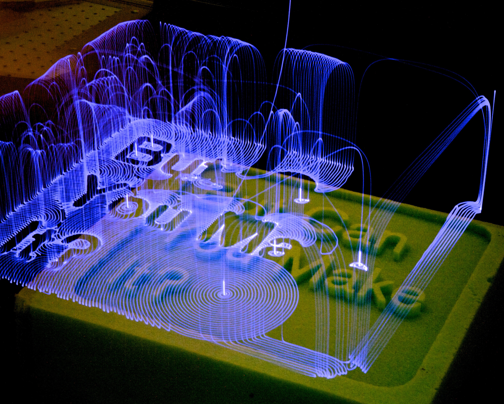

In my first fall at MIT in 2011 I was an undergraduate research assistant for Steven Keating (whom a few years later ["dissected his own brain"](https://www.wired.com/2016/02/the-man-who-dissected-his-own-brain/)) in the Mediated Matter Group. I mainly worked with a KUKA robotic arm helping Steven explore his ideas for rapid construction fabrication.

When I got my position at the lab I had just transferred schools and was eager to work on something cool outside of my classes. MIT was reknowned for encouraging undergraduate research. It was so common that the abbreviation of the program that facilitated undergraduate research was a verb in MIT-speak: "UROPing." Getting a position in the Media Lab was a dream come true! And one that involved 3D printing, no less. I had done extracurricular research on 3D printing a year before at USAFA that ended up being a significant factor in getting into MIT. In a year I'd gone from working late nights in a backroom electronics lab by myself to being surrounded by hundreds of brilliant people working all kinds of clever, futuristic projects in one of the most beautiful buildings I'd ever seen. 😲 💙 <small>_and 👋 imposter syndrome!_</small>

# KUKA Robot Language

Over the course of the semester I learned how to program the robotic arm, which used ~~a simple, very popular, well documented language~~ their awful proprietary language called KUKA Robot Language. It was a far cry from uploading commands to a Makerbot like I'd done during my research the year prior, and a couple steps up the computing stack from the low-level digital design I had done in my classes so far. I spent many hours that fall poring over their thick printed manual, learning their logic & commands (which included their own coordinate system), and hacking away. I started with tiny programs of just a few commands and built my way up. I crashed the system often. I found its boundaries. It was my first time being handed a manual for a big, fancy robot and getting paid to figure out how to use it, how to master it. It was awesome. 😄

# Foam shells

The idea I helped to explore the most was being able to rapidly create building shells using quick-drying foams in an additive, "3D printing" fashion. This was early on in a multi-year project. Building this prototype system for building smaller structure shells would teach us a lot about the material and design challenges for doing so at a larger scale.

# Art and technology

In addition to our main focus of prototyping foam shells, we experimented with using the robotic arm in other fun and artistic ways. This was one of the first times I started to see how technology, even something as "serious" as a robotic arm, can be used for expressive and delightful ends.

