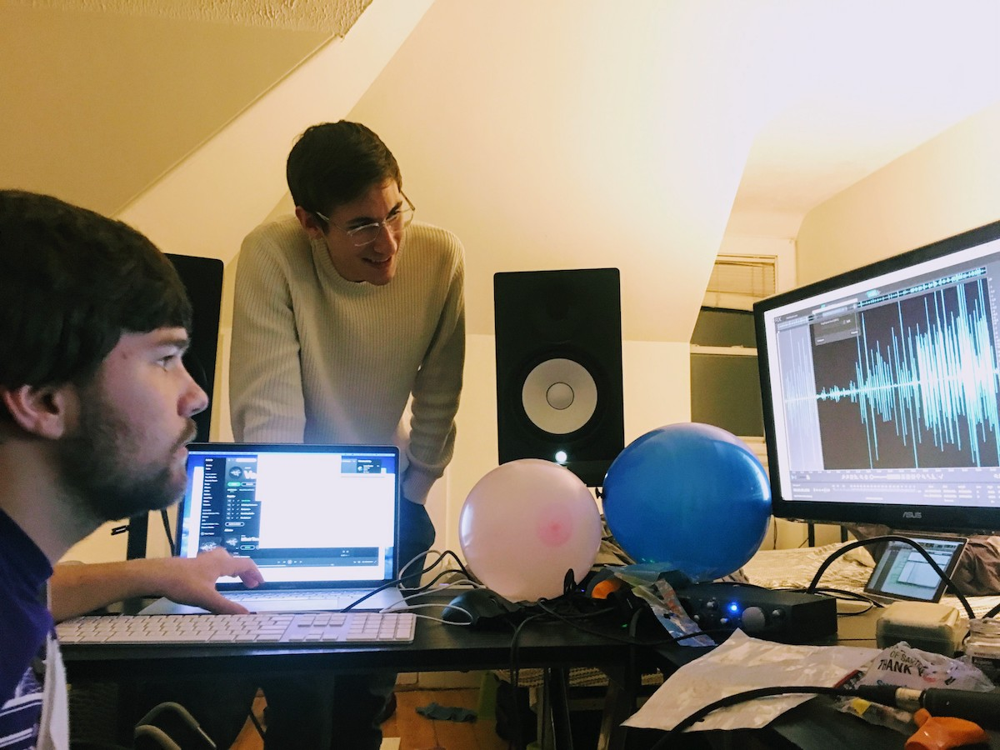

After Apple's announcement of ARKit and leaving my job at [Sidekicks](sidekicks) in June of 2017, I began a six month sabbatical researching and learning design and development for augmented reality development. I was inspired to found [Out Here Studio](//outhere.studio), an independent creative software business, after foreseeing unique social entertainment possibilities using augmented reality in the next few years.

# Out Here Archery

I published my first title in December 2017, [Out Here Archery](https://itunes.apple.com/us/app/out-here-archery/id1309822636?mt=8), a playful first person shooter using balloons and arrows in mobile augmented reality.

https://www.youtube.com/watch?v=kPtwy8a9Gg8

## Gameplay design

I bucked the trend of small-scale, table-top AR experiences I was observing to make something that was immersive — something that would surround the player and interact with their environment. I paid particular attention to how the balloons and arrows interacted with surfaces — where the balloons would inflate from, how the arrows would stick or scatter from where they landed.

### Environment

I paid careful attention to interactions such as how the arrows stuck into surfaces

### Physics

## Audio design

I collaborated with Maxime Gautier and Noah Sitrin on the game's audio design. I paid particular attention to the spatial nature of each interaction.

## Modeling

I did all of the 3D modeling for the game in virtual reality, using my HTC Vive and the Google Blocks program. I had no CAD experience prior to this point. The intuitiveness and fun of modeling in VR with Google Blocks was a huge motivation when getting started.

I published all of the 3D models I created for the game on [Google Poly](https://poly.google.com/user/6ygncoac9fM) under the Creative Commons Attribution license. You are free to download and remix them into your creations as you like.

## Prototypes

https://www.youtube.com/watch?v=NMPbNBC0L4E

https://www.youtube.com/watch?v=q9oYHUkPWzc

## Testing

I beta tested the game for about five weeks, recruiting family, friends, and friends of friends to play through it. The new screen recording ability built into iOS 11 was very helpful. The kids who were testers would prove to be the most critical.

<figure style="max-width: 400px;">
<video src="playtest.mp4" controls width="100%"></video>
<figcaption>
This was the first play video I got after putting out the beta. I could not stop smiling the first time I saw it, I watched it at least three times in a row 😄 Kids are the absolute best.
</figcaption>
</figure>
