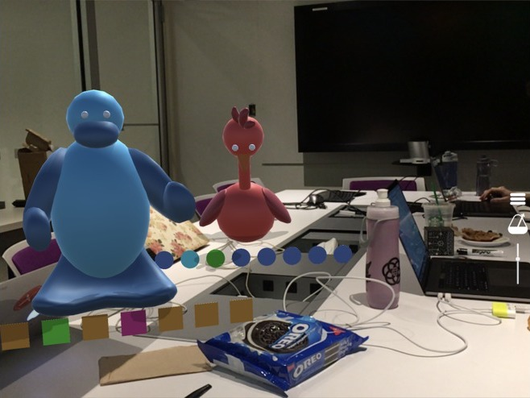

At the 2017 Reality, Virtually, Hackathon I was a part of team Augmented Fifth that made a playful music composition experience using mobile augmented reality. In the experience you create music by placing and interacting with animal characters in the physical space around you.

https://www.youtube.com/watch?v=gx8RDOu5F1k

# Inspiration

Our original inspiration for the project was to explore immersive sound composition in augmented or virtual reality. We chose mobile augmented reality for its accessibility and shareability.

# Contributions

I worked on the augmented reality interactions and 2D user interface. This included the placement and tracking of characters within the scene, and the side menu where you can choose characters, adjust the tempo, and reset the scene.

You can find more details about the project on [our Devpost project](https://devpost.com/software/augmented-fifth) and get the code on [our GitHub repo](https://github.com/Reality-Virtually-Hackathon/Augmented-Fifth). You can open the project in Unity, but it will not run because we did not upload some of the larger dependency files. All of the art, assets, and code that we made is there, but you will need to install some missing files to be able to run it yourself.

