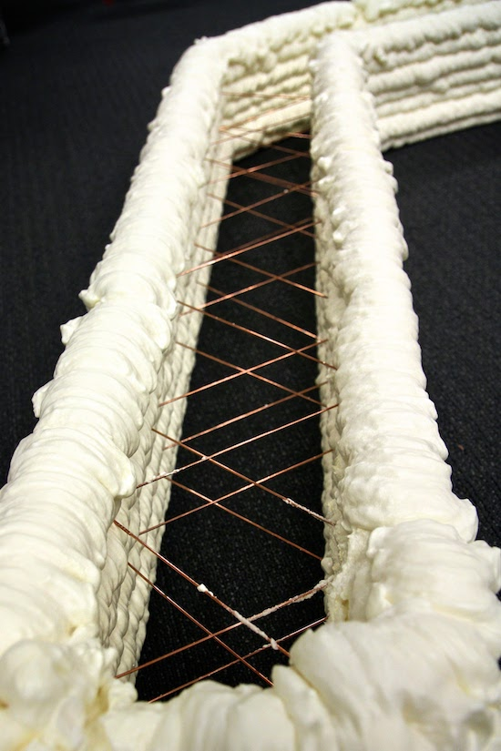

In my first fall at MIT in 2011 I was an undergraduate research assistant for Steven Keating (whom a few years later ["dissected his own brain"](https://www.wired.com/2016/02/the-man-who-dissected-his-own-brain/)) in the Mediated Matter Group. I mainly worked with a KUKA robotic arm helping Steven explore his ideas for rapid construction fabrication.

I had just transferred schools and was very eager to work on something cool outside of my classes. Getting to do that in the Media Lab was a dream come true. I was beyond excited to be working on 3D printing as well. I had done some extracurricular research on 3D printing a year before at USAFA, which ended up being a significant factor in getting into MIT. I went from working late nights in an electronics lab by myself to being in one of the most beautiful buildings I'd ever seen surrounded by hundreds of brilliant people working all kinds of clever, futuristic projects. 💙 😲 💙 <small>_and 👋 imposter syndrome!_</small>

# KUKA Robot Language

Over the course of the semester I learned how to program the robotic arm, which used ~~a simple, very popular, well documented language~~ their awful proprietary language called KUKA Robot Language. It was a far cry from uploading commands to a Makerbot like I'd done during my research the year prior, and a couple steps up the computing stack from the low-level digital design I had done in my classes so far. I spent many hours that fall poring over their thick printed manual, learning their coordinate system, and hacking away. I started with tiny programs of just a few commands. I crashed the system often. I found the boundaries of the system and understanding its abstractions. All the usual fun of learning a new platform. 😅

# Foam shells

The specific idea I was helping to explore is being able to rapidly create building shells using quick-drying foams in an additive, "3D printing" fashion. This was early on in a multi-year project. Building this prototype system for building smaller structure shells would teach us a lot about the material and design challenges for doing so at a larger scale.

# Art and technology

In addition to our main focus of prototyping foam shells, we experimented with using the robotic arm in other fun and artistic ways. This was one of the first times I started to see how even "serious" technology can be used for artistic and delightful means.

I ended up only working with Steven for one semester, but I enjoyed it immensely, learned a great deal, and absolutely loved working in the Media Lab its spirit of combining art and technology.

