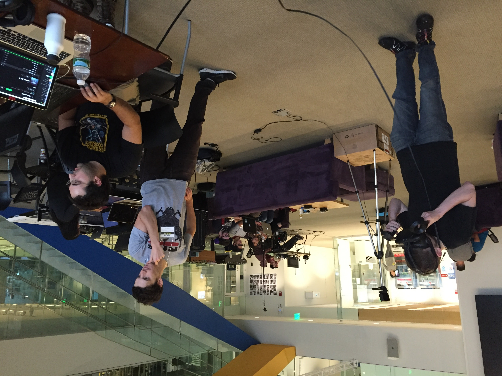

In the fall of 2016, I participated in the MIT Media Lab's first annual [Reality, Virtually, Hackathon](https://www.realityvirtuallyhack.com/). It was my first time designing or developing a 3D experience of any kind, let alone a virtual reality one. Over the course of the weekend I got a taste of building with Unity, 3D modeling, and programming in C#, and a hefty dose of excitement for virtual and augmented reality. This was the spark that eventually led me to pursue X Reality development as my full-time job.

I was a part of the wonderful Team ZeeGee with Max Rose, Daniel Bryand, Alan Foster, and Leonard Wedderburn. We made a virtual reality experience for the HTC Vive that explored locomotion and interaction.

# Zero Gravity Frisbee

Our original goal had been to make a low-gravity ultimate frisbee-like multiplayer game, but we quickly understood that would be out of scope to make in two days. We limited our scope to building the environment, and nailing the physics for locomotion and the frisbee. Our final product was a low-gravity space environment where you could fling yourself from platform to platform throwing frisbees.

It's easier to show than tell, so check out this gameplay video to get a better understanding.

https://www.youtube.com/watch?v=MmeWOyucehQ

Aside from the frisbee, all of the items in the environment were created using [Google's Tilt Brush VR application](https://www.tiltbrush.com/). We were delighted at how simple it was to export designs from Tilt Brush and import them into Unity. Max was even able to rig up the human spaghetti figure and add some animations. The pedestals for the frisbees and the floating coils were some of my creations. 💁‍♂️

In addition to my beautiful art, I designed and implemented the subtle particle effect that you first see at 0:22 in the video. This may seem small, but it had a significant effect on reducing nausea for the user.

# Crash course in VR interaction design

The whole weekend was a crash course in the nuance and difficulty of VR interaction design. Every interaction needed thorough consideration and testing of the physics behind it. Some of the questions we found ourselves wrestling with:

* How _do_ the physics of a frisbee work?
* How many degrees of freedom should you have? Should you be able to tumble through space?
* How do we convey the sensations of motion and speed when your flying through empty space?
* How do we determine the amount of force exerted when you fling yourself with the controllers?

The initial version of the frisbee and locomotion physics were surprisingly quick to implement. The majority of the work was in tweaking and testing, (and reading research on frisbee physics). We made ourselves nauseous more than a couple times trying to figure out the best parameters for locomotion; spinning around in six degrees of freedom in virtual outerspace will do that to you. 🤢 It all paid off — none of the people who tried out our experience reported feeling nauseated.

One of my key learnings from the weekend was that the goal when designing for virtual reality should not be to mimic reality exactly, but rather to create what _feels_ best. More often than not, an experience with 100% accurate physics simulation is difficult or uncomfortable. For instance, learning to navigate a low-gravity environment takes months of training, and even then is still an arduous task. We mitigated that difficulty by adding the ability to stop dead in your tracks by squeezing the triggers, and by restricting the degrees of freedom so you can't accidentally start spinning yourself. I went in with the notion that realism is the ultimate goal, and came out understanding that it certainly is not.

# Best Interactive Hack

Our hack won the [Best Interactive VR award](http://www.realityvirtuallyhack.com/winners-2016/) for the hackathon, earning each of us a PlayStation VR. Thanks Sony! 😄

You can find our [source code on GitHub](https://github.com/sirerr/zerograv) and [our very sparse project write-up on Devpost](https://devpost.com/software/zeegeeball). The source code is completely functional. If you have an HTC Vive you should be able to download the repo, build the project in Unity, and run it on your device. Feel free to get in touch with me if you give it a try and are having trouble.

